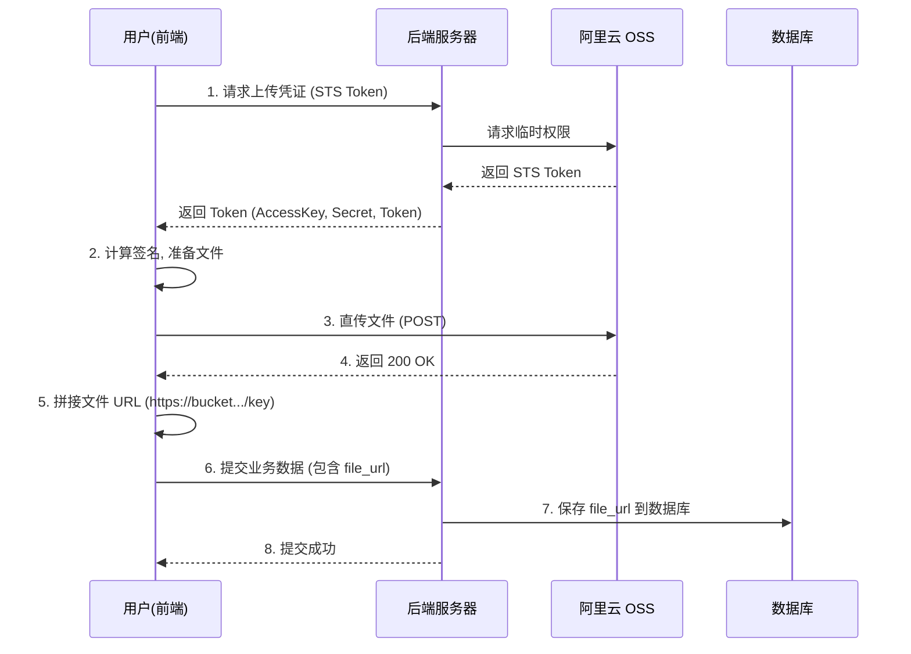

# 阿里云 OSS 集成全指南：从上传到入库

本文档详细说明了如何实现“前端直传阿里云 OSS -> 获取文件地址 -> 存入数据库”的完整流程。

## 一、 整体流程图解



## 二、 关键步骤实施指南

### 第一步：阿里云配置 (至关重要)

在代码能跑通之前，必须先配置好阿里云权限。目前的报错 `403 AccessDenied` 就是因为缺少这一步。

1.  **登录阿里云 RAM 控制台**。
2.  找到你 `.env` 中配置的那个 RAM 用户 (`LTAI...`)。
3.  **添加权限**:
    *   点击“添加权限”。
    *   搜索并添加 **AliyunOSSFullAccess** (管理对象存储服务(OSS)权限)。
    *   *(或者创建自定义权限策略，仅允许对 `yukino-oss` Bucket 的 PutObject 操作)*。
4.  **配置 Bucket 跨域 (CORS)**:
    *   进入 OSS 控制台 -> Bucket 列表 -> `yukino-oss`。
    *   数据安全 -> 跨域设置 -> 创建规则。
    *   **来源**: `*` (开发阶段) 或你的前端域名。
    *   **允许 Methods**: `GET`, `POST`, `PUT`, `HEAD`。
    *   **允许 Headers**: `*`。
    *   **暴露 Headers**: `ETag`, `x-oss-request-id`。

### 第二步：后端配置 (保持现状)

你的后端已经配置好了获取 STS Token 的接口。

*   **接口**: `GET /api/oss/sts-token`
*   **作用**: 给前端发“通行证”。

### 第三步：前端上传 (核心逻辑)

使用项目根目录下的 `oss.js` (已重写为通用版)。

**使用示例 (以提交作业为例)**:

```javascript
import { uploadFile } from '@/oss.js'; // 引入封装好的上传模块

async function submitHomework() {
    try {
        // 1. 选择文件
        const [err, res] = await uni.chooseMessageFile({ count: 1, type: 'all' });
        if (err) return;
        const filePath = res.tempFiles[0].path;
        
        // 2. 上传到 OSS (指定目录为 homeworks)
        // uploadFile 会自动处理 STS Token 获取、过期刷新、签名计算
        const ossResult = await uploadFile(filePath, 'homeworks');
        
        // 3. 拿到新地址！
        const newFileUrl = ossResult.url; 
        console.log('阿里云返回的新地址:', newFileUrl);
        
        // 4. 将地址存到数据库
        // 调用后端提交作业接口
        const submitRes = await uni.request({
            url: 'http://localhost:3000/api/tasks/1/submit',
            method: 'POST',
            data: {
                file_url: newFileUrl, // <--- 这里就是核心：把地址传给后端
                content: '这是我的作业描述',
                file_name: ossResult.name
            },
            header: { Authorization: 'Bearer ...' }
        });
        
        if (submitRes.statusCode === 200) {
            console.log('数据库保存成功');
        }
        
    } catch (e) {
        console.error('流程失败', e);
    }
}
```

### 第四步：后端保存 (已就绪)

后端 `taskController.js` 的 `submitTask` 方法已经写好了接收 `file_url` 并存入 `course_student_work` 表的逻辑：

```javascript
// src/controllers/taskController.js 片段
async submitTask(req, res) {
    // ...
    const { file_url, content } = req.body; // 接收前端传来的 URL
    
    // ...
    await CourseStudentWork.create({
        // ...
        file_url: file_url, // 存入数据库
        // ...
    });
    // ...
}
```

## 三、 备选方案：后端代理上传

如果你不想要在前端处理复杂的签名逻辑，可以使用后端的代理接口（我已经修复了权限提示）。

1.  **前端**: 将文件通过 `uni.uploadFile` 传给后端 `/api/upload/homework`。
2.  **后端**: 
    *   接收文件。
    *   上传到 OSS。
    *   返回 `{ url: "https://..." }` 给前端。
3.  **前端**: 拿到 URL 后，再调用 `submitTask` 接口存入数据库。
    *   *(或者后端可以直接在 upload 接口里做更多事情，但通常保持上传接口纯粹比较好)*。

## 四、 常见问题排查

1.  **上传报 403**: 
    *   检查 RAM 用户是否有 `AliyunOSSFullAccess`。
    *   检查 Bucket 是否开启了 CORS。
2.  **URL 无法访问**:
    *   检查 Bucket 权限是否为“公共读” (Public Read)。如果是私有 Bucket，生成的 URL 需要带签名才能访问（会很长且有时效性）。建议 `uploads/` 目录下的资源设为公共读。
3.  **SignatureDoesNotMatch**:
    *   通常是 AccessKeySecret 填错，或者前端计算签名的算法（HMAC-SHA1）有问题。确保使用了正确的 Crypto 库。
